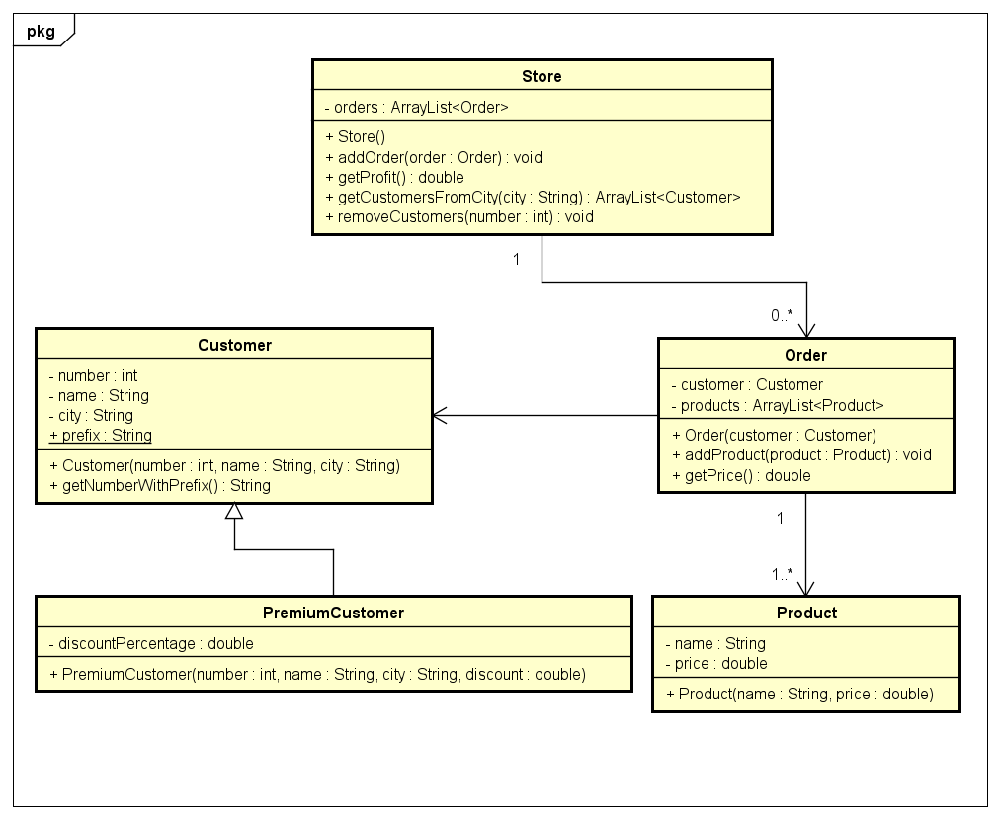

# Startdocument for Store

Startdocument of **Jan Doornbos**. Student number **1234567**.

## Problem Description

We have a store with two types of customers. A regular customer: he has a customer number, name and city. There also is a premium customer: he is the same as a regular customer, but also has a discount percentage. All customers have a prefix in the customer number: MM_. This prefix is the same for all customers. If this prefix is changed, it should update for ALL the customers. Make a method that returns this prefix and the customer number combined. The store also contains of products. A product contains a name and a price. The store can accept orders.

Design and program an application based on the text above. The store also wants a method that can fetch all the customers from a certain city. Because of legacy issues, you also need to make a method that removes all the customers with a customer number smaller than a given value. The financial department also wants to know the total profit of the store.

Make sure you application is well documented with Javadoc. Make sure it is Unit tested as well.

### Input & Output

In this section the in- and output of the application will be described.

#### Input

In the table below all the input (that the user has to input in order to make the application work) are described.

|Case|Type|Conditions|
|----|----|----------|
|Customer number|`integer`|0 < `number` < 20|
|Name Of Customer|`String` |not empty|
|City Of Customer|`String` |not empty|
|Customer Discount|`double`|0 < `number` <= 100|
|Product name|String|not empty|
|Product price|`double`|`number` > 0|

#### Output

|Case|Type|
|----|----|
|Customers from a certain city|`ArrayList<Customer>`|
|The profit of the store|`double`|
|The price of a order|`double`|

#### Calculations

| Case              | Calculation                        |
| ----------------- | ---------------------------------- |
| Price of an order | The sum of all the product prices. |

#### Remarks

* Input will be validated.
* Only the Main class will contain `System.out.println`
* Unit Tests will be provided.

## Class Diagram

## Testplan

In this section the testcases will be described to test the application.

### Test Data

In the following table you'll find all the data that is needed for testing.

#### Product

| ID            | Input                             | Code                              |
| ------------- | --------------------------------- | --------------------------------- |
| `playstation` | name: PlayStation price: 250 | `new Product("PlayStation", 250)` |
| `imac`        | name: iMac price: 1400       | `new Product("iMac", 1400)`       |

#### Customer

| ID        | Input                                                        | Code                                               |
| --------- | ------------------------------------------------------------ | -------------------------------------------------- |
| `jan`     | number: 1 name: Jan city: Emmen                    | `new Customer(1, "Jan", "Emmen")`                  |
| `martijn` | number: 2 name: Martijn city: Emmen discount: 20% | `new PremiumCustomer(2, "Martijn", "Emmen", 20.0)` |

#### Store

| ID           | Input | Code          |
| ------------ | ----- | ------------- |
| `mediamarkt` |       | `new Store()` |

#### Order

| ID           | Input               | Code                 |
| ------------ | ------------------- | -------------------- |
| `appleorder` | customer: `jan`     | `new Order(jan)`     |
| `psorder`    | customer: `martijn` | `new Order(martijn)` |

#### Attach Products To Orders

| Order        | Code                      |
| ------------ | ------------------------- |
| `appleorder` | `addProduct(imac)`        |
| `psorder`    | `addProduct(playstation)` |
| `psorder`    | `addProduct(playstation)` |

### Test Cases

In this section the testcases will be described. Every test case should be executed with the test data as starting point.

#### #1 Customer Number Prefix

Verifying the prefix of the user. The customer number should be prefixed.

|Step|Input|Action|Expected output|
|----|-----|------|---------------|
|1| `jan` | `getNumberWithPrefix()` |MM_1|

#### #2 Get All The Customers From A City

Testing the method to get all the customers from a city. 

|Step|Input|Action|Expected output|
|----|-----|------|---------------|
|1|`mediamarkt`|`getCustomersFromCity("Emmen")`|Empty ArrayList|
|3|`mediamarkt`|`addOrder(appleorder`)||
|4|`mediamarkt`| `getCustomersFromCity("Emmen")` | ArrayList with customer `jan` |

#### #3 Remove Customers With A Smaller Customer ID

Testing that we can remove customers based on the id lower than the given input.

|Step|Input|Action|Expected output|
|----|-----|------|---------------|
|1|`mediamarkt`|`removeCustomers(1)`||
|2| `mediamarkt` |`getCustomers()`|ArrayList with only customer `martijn`|

#### #4 Get Order Price

Testing the price method for an order. The `psorder` has a `PremiumCustomer` attached.

| Step | Input        | Action       | Expected output |
| ---- | ------------ | ------------ | --------------- |
| 1    | `appleorder` | `getPrice()` | 1400            |
| 2    | `psorder`    | `getPrice()` | 400             |

#### #5 Get Store Profit

Testing the total store profit.

| Step | Input        | Action                 | Expected output |
| ---- | ------------ | ---------------------- | --------------- |
| 1    | `mediamarkt` | `addOrder(appleorder)` |                 |
| 2    | `mediamarkt` | `getProfit()`          | 1400            |
| 3    | `mediamarkt` | `addOrder(psorder)`    |                 |
| 4    | `mediamarkt` | `getProfit()`          | 1900            |

