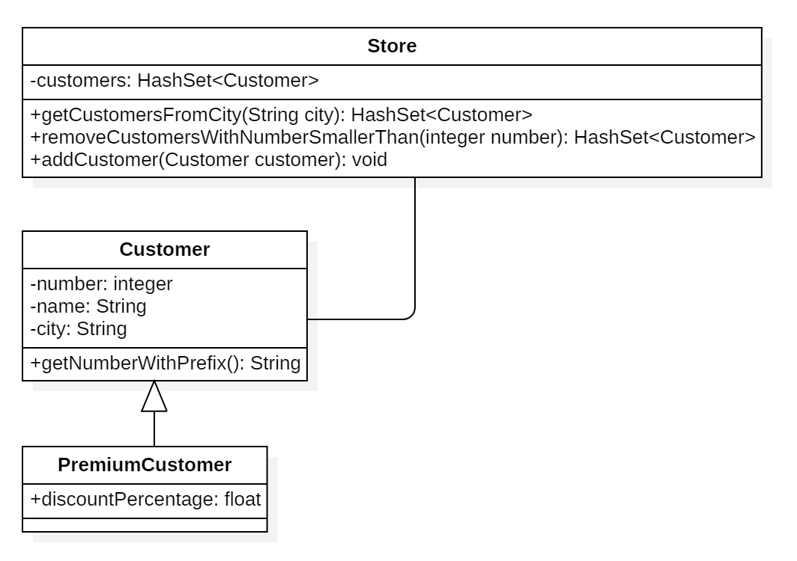

# Startdocument for Store

Startdocument of **Jan Doornbos**. Studentnumber **1234567**.

## Problem Description

We have a store with two types of customers. A regular customer: he has a customer number, name and city. There also is a premium customer: he is the same as a regular customer, but also has a discount percentage.All customers have a prefix in the customer number: MM_. This prefix is the same for all customers. If this prefix is changed, it should update for ALL the customers. Make a method that returns this prefix and the customer number combined.
* Make a store that holds both types of customers.
* Make a method that can fetch all the customers from a certain city.
* Make a method that removes all the customers with a customer number smaller than a given value.
* Document your code with Javadoc.
* Write Unit tests for your application.

### Input & Output

In this section the in- and output of the application will be described.

#### Input

|Case|Type|Conditions|
|----|----|----------|
|Customer number|`integer`|0 < number < 20|
|Name|`String` |not empty|
|City|`String` |not empty|
|Discount|`float`|0 < number <= 100|

#### Output

|Case|Type|
|----|----|
|Customers from city|`ArrayList<Customer>`|

#### Remarks

* Input will be validated.
* Only the Main class will contain `System.out.println`
* Unit Tests will be provided.

## Testplan

In this section the testcases will be described to test the application.

### Testcase #1

|Step|Input|Action|Expected output|
|----|-----|------|---------------|
|1|1 Jan Emmen|createCustomer()|Customer created|
|2| |customer.getNameWithPrefix()|MM_1|

### Testcase #2

|Step|Input|Action|Expected output|
|----|-----|------|---------------|
|1|1 Jan Emmen|createCustomer()|Customer created|
|2|2 Martijn Nieuw Weerdinge|createCustomer()|Customer created|
|3|Emmen|getCustomersInCity()|The customer Jan is living in Emmen|

### Testcase #3

|Step|Input|Action|Expected output|
|----|-----|------|---------------|
|1|1 Jan Emmen|createCustomer()|Customer created|
|2|2 Martijn Nieuw Weerdinge|createCustomer()|Customer created|
|3|2|removeCustomersByNumberSmallerThan()|The customer Jan is removed|
|4| |getCustomers()|1 customer found|

## UML Diagram

